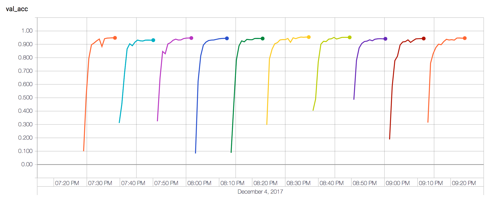

# Kaggle: TensorFlow Speech Recognition Challenge
https://www.kaggle.com/c/tensorflow-speech-recognition-challenge/

## V1 Flow

### Generating training data

1. Sample one of valid labels (+ unknown, silence)
1. Pick one of the clips or...
1. ...If 'silence' picked, generate silence clips from background noise provided
1. Randomly mix sample with background noise provided, transform pitch/speed/volume
1. Compute mel-scaled spectrogram
1. Scale to match mean, std dev with a pre-fit scaler
1. ...
1. profit!

### Inference

1. Output model activations (after softmax) to CSV for multiple training runs/model variations
1. Generate submission with voting/averaging strategy
1. Predict same file many times with different transfromations and average/vote result (?, if performance allows)

## Ideas

- Record more noise

## V2 Flow

1. Generate holdout set
1. Generate 10 folds from filenames
1. Generate training set excl. holdout set
1. Train 10 L1 models, predict on test and holdout sets
1. Train L2 model from predictions on holdout set
1. Predict using L1 test prtedictions as inputs